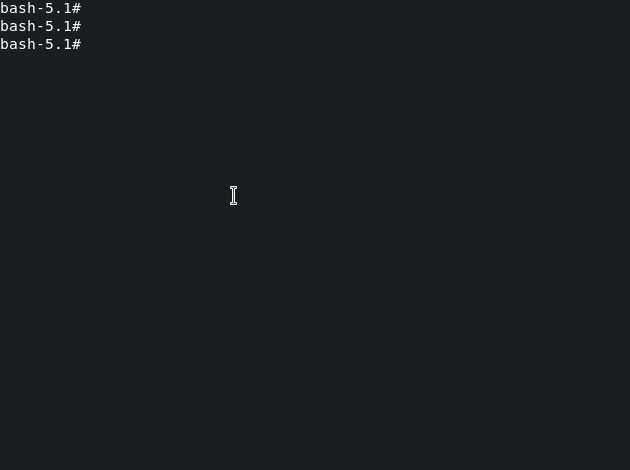

# Google Cloud Profile Switcher (GCPS)

[](https://golang.org/)
[](https://github.com/daftcreations/gcps/blob/master/LICENSE)
[](https://github.com/daftcreations/gcps/releases)
[](https://github.com/daftcreations/gcps/actions/workflows/release.yml)

[](https://discord.com/channels/960581263264219186/960618259244257330)

Switch between Google Cloud Profiles easily

## Usage



- Switch through list `gcps` will return configured profile.

- Switch to particular profile `gcps {profile_name}`

- Switch to previous profile `gcps -`

## Installation

Golang

```shell
go install github.com/naman2706/gcps@latest
```

OR

```shell
## Linux
curl -fsSL instl.sh/daftcreations/gcps/linux | bash

## MacOS (m1 and intel)
curl -fsSL instl.sh/daftcreations/gcps/linux | bash

## Windows
iwr -useb instl.sh/username/reponame/windows | iex
```

> probably have to source `.bashrc` or `.zshrc` or `.profile` to make it work

## Future Development

Check our project and socials

---

[](https://discord.com/channels/960581263264219186/960618259244257330)
[](https://www.youtube.com/c/DaftCreation/playlists)
[](https://twitter.com/daftcreation)
[](https://www.instagram.com/daft.creations/)

### Contributors


### Stargazers over time

[](https://starchart.cc/Naman2706/gcps)

---

> > *May the source be with you*
